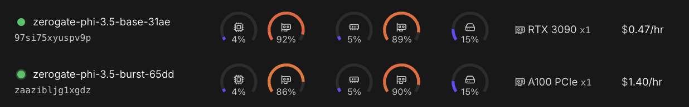

# ZeroGate Client

A client-side workload simulator for ZeroGate.

The `client.py` script demonstrates how to fire high-concurrency vLLM payloads directly through ZeroGate. This allows you to simulate intense production traffic and observe how the gateway handles dynamic cluster scaling inside your RunPod sandbox.

- Runs natively on Python 3.12+
- Zero external package installations required

## Quickstart

### 1. Configure Credentials

Generate a throwaway RunPod key and export it.

```bash
export RUNPOD_API_KEY="your_runpod_api_token_here"
```

### 2. Run the Stress Test

Execute `client.py` to stream concurrent requests through the ZeroGate control plane.

```bash

# Test with random model clusters (Llama + Phi)
python client.py

# Force route specific vLLM configurations
python client.py phi

# Example usage for heavy burst testing:
SIM_TOTAL_REQUESTS=40 python client.py phi

```

### 3. Verify Nodes

View your `base` and `burst` nodes on your RunPod dashboard.



### 4. Verify Results

Monitor inference results and cluster analytics directly from your terminal.

View results for a single request:

```bash
curl -s -X GET https://api.zerogate.cloud/v1/status/<task_id>
```

```json
{
  "request_id": "ba6c80b2-9fba-4b6e-b8af-d60e0500125e", "status": "completed", "model": "microsoft/Phi-3.5-mini-instruct",
  "metrics": { "execution_duration_seconds": 2.76, "estimated_savings_usd": 0.0015 },
  "prompt": "Analyze the economic drain of unmanaged bare-metal GPU idle time for AI start-ups...",
  "result": "The economic drain on AI start-ups from unmanaged GPU idle time..."
}
```

Fetch live, aggregated workspace telemetry:

```bash
curl -s -X GET "https://api.zerogate.cloud/v1/analytics" -H "X-ZeroGate-Key: zerogate-beta-key"
```

```json
{
  "workspace_key": "zerogate-beta-key", "status": "Healthy.",
  "ledger": { "total_inferences": 200, "total_tokens": 142850, "idle_tax_saved_usd": 0.35, "avg_duration_ms": 12416.4 }
}
```

---

## Security & Liability

* **Zero Financial Liability**: All underlying GPU compute runs entirely on your own RunPod account. ZeroGate never charges your card or carries financial liability for your infrastructure.

* **Stateless Token Pipeline**: Your API keys are processed strictly in volatile memory during active infrastructure scheduling cycles and are never written to database disks or logs.

---

## Design Partner Access & Inquiries

ZeroGate is currently in a closed beta phase, hand-selecting 3–5 early-stage technical founders running heavy vLLM + RunPod workloads to stress-test our control plane.

If your script validation was successful and you want to graduate from the sandbox to production:

* **Direct Engineering Support:** If you want help configuring ZeroGate's autoscaling thresholds directly inside your core infrastructure pipeline, reach out to me directly.
* **Lead Engineer:** Noah Garner
* **Direct Outreach**: https://www.linkedin.com/in/noah-douglas-garner/
